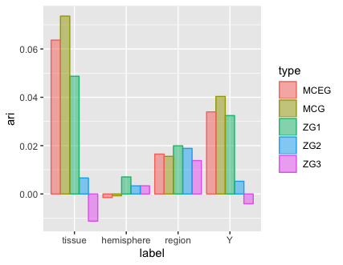

# Simultaneous Dimensionality and Complexity Model Selection for Spectral Graph Clustering

Congyuan Yang, Carey E. Priebe, Youngser Park, David J. Marchette

https://arxiv.org/abs/1904.02926

## Abstract

Our problem of interest is to cluster vertices of a graph by identifying its underlying community structure. Among various vertex clustering approaches, spectral clustering is one of the most popular methods, because it is easy to implement while often outperforming traditional clustering algorithms. However, there are two inherent model selection problems in spectral clustering, namely estimating the embedding dimension and number of clusters. This paper attempts to address the issue by establishing a novel model selection framework specifically for vertex clustering on graphs under a stochastic block model. The first contribution is a probabilistic model which approximates the distribution of the extended spectral embedding of a graph. The model is constructed based on a theoretical result of asymptotic normality of the informative part of the embedding, and on a simulation result of limiting behavior of the redundant part of the embedding. The second contribution is a simultaneous model selection framework. In contrast with the traditional approaches, our model selection procedure estimates embedding dimension and number of clusters simultaneously. Based on our proposed distributional model, a theorem on the consistency of the estimates of model parameters is stated and proven. The theorem provides a statistical support for the validity of our method. Heuristic algorithms via the simultaneous model selection framework for vertex clustering are proposed, with good performance shown in the experiment on synthetic data and on the real application of connectome analysis.

## Demo code

This is a brief explanation of this demo. The codes can produce the results for the experiment on connectome dataset `DS01216`.

To start, type in `R` prompt:

```
> source("main.R"")
```

On top of the `main.R` file, there are 4 global parameters:

* `fileIndex` indicates the index of the graph in the data set `DS01216`. It be from 1 to 114.
* `D` indicates the dimension of the extended adjacency spectral embedding.
* `dmax` indicates the boundary of the scanning of `d`. So we will scan `d` from 1 to `dmax`. 
* `kmax` indicates the boundary of the scanning of `K`. So we will scan `K` from 1 to `kmax`.

The example in the paper (with `dmax=50` and `kmax=30`) may take ~30 hours to run. To speed up, we can set smaller `dmax` and `kmax`, e.g., `dmax=3` and `kmax=3`, which takes about < 15 minute in a decent laptop computer.


<p class="caption">
The proposed methods win against `tissue` & `Y`
in this case where ZG1 is the best of the ZGs. This suggests that the proposed methods are competitive with the best of the ZGs,
so no need to guess twixt ZG1,2,3
</p>